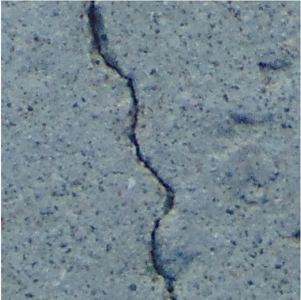
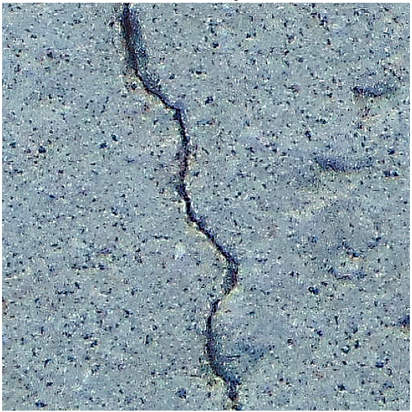

# Introduction
An implementation of a high boost sharpening filter for improvising the high frequency contents and image contrast.

# Quick Pipeline Visualization
## Example: Filtered image
| Original Image | Filtered Image |
| ------------- | ------------- |
|  |  |

# Requirements
Python  
matplotlib==3.10.0  
numpy==2.2.1  
opencv_contrib_python==4.10.0.84  
opencv_python_headless==4.10.0.84  
scipy==1.14.1  

# Feedback
Please rate and provide feedback for the further improvements.
